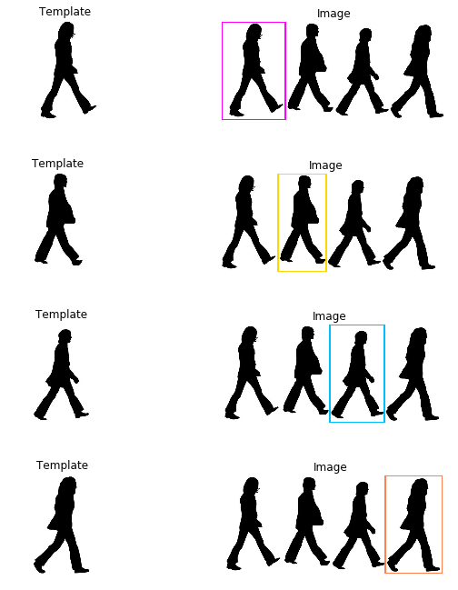

# Crosswalk
Meet The Beatles at Abbey Road for image processing in a jupyter notebook.

Preview at [nbviewer!](https://nbviewer.jupyter.org/github/brugr9/Crosswalk/blob/master/Crosswalk.ipynb)



### Prerequisites:
```python
pip install -U jupyter scikit-image
```

### Clone and run:
```python
git clone https://github.com/brugr9/Crosswalk.git
cd Crosswalk
jupyter notebook
```
